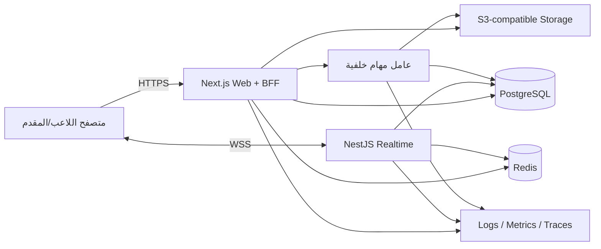

# البنية التقنية — تحدّي

> هذه وثيقة قرار للمرحلة الأولى وليست إعدادًا منفذًا. تُثبت إصدارات الحزم في المرحلة الثانية بعد التحقق من التوافق.

الوثائق المرتبطة: `product-requirements.md` للنطاق ومعايير القبول، `user-flows.md` للتدفقات، و`permissions.md` للتفويض.

## 1. مبادئ البنية

1. PostgreSQL مصدر الحقيقة للهوية والمحتوى والإجابات والنتائج.
2. Redis حالة تشغيلية مؤقتة للتنسيق والـrate limit والـleases والبث، وليس أرشيفًا وحيدًا.
3. الخادم وحده يقرر الوقت والإجابة المقبولة والنقاط وانتقالات حالة الجلسة.
4. كل أمر قابل للتكرار يحمل `commandId` أو `submissionId` ويعالج idempotently.
5. عزل المؤسسة يطبق في المستودعات والخدمات والسياسات، لا في الواجهة فقط.
6. نبدأ Modular Monolith بخدمتين تشغيليتين، لا Microservices كثيرة قبل وجود حمل يبررها.

## 2. القرار المعماري

### الاختيار

- Monorepo TypeScript باستخدام pnpm workspaces وTurborepo.
- `apps/web`: Next.js App Router للواجهة وBFF وREST/Server Actions غير اللحظية.
- `apps/realtime`: NestJS مع Socket.IO لخدمة الاتصالات الطويلة ومحرك الجلسة.
- `packages/domain`: القواعد والأنواع ومعادلة النقاط وانتقالات الحالة.
- `packages/contracts`: مخططات Zod المشتركة وأسماء الأحداث، دون أسرار أو منطق ثقة بالعميل.
- `packages/db`: Prisma schema وعميل قاعدة البيانات والمهاجرات.
- PostgreSQL وRedis وتخزين S3-compatible.

### لماذا ليست خدمة Next.js وحدها؟

تطبيق Next.js مناسب للواجهة وBackend-for-Frontend، لكن بعض بيئات تشغيل Route Handlers تنهي التنفيذ بعد الاستجابة ولا تدعم WebSocket طويل العمر. لذلك تُفصل خدمة الزمن الحقيقي في عملية Node دائمة، بينما تبقى القواعد المشتركة في حزم داخل المستودع نفسه.

### لماذا Socket.IO؟

يوفر غرفًا وإقرارات وإعادة اتصال ونقلًا احتياطيًا، لكنه لا يلغي ضرورة مزامنة الحالة. في التوسع الأفقي نستخدم Redis Streams Adapter مبدئيًا لأنه يدعم استعادة حالة الاتصال، مع Snapshot تطبيقي كمسار موثوق دائم. إذا اختير Redis Pub/Sub Adapter بدلًا منه في بيئة ما، فيجب توثيق أنه لا يدعم Connection State Recovery وأن Sticky Sessions مطلوبة.

## 3. مخطط الحاويات



## 4. هيكل المستودع المستهدف

```text
apps/
  web/
    src/app/
    src/components/
    src/features/
    src/server/
  realtime/
    src/gateways/
    src/modules/live-sessions/
    src/guards/
  worker/
packages/
  ui/
  domain/
  contracts/
  db/
  config/
prisma/
docs/
tests/
  e2e/
  load/
```

## 5. حدود الوحدات

| الوحدة | مسؤوليتها | لا تملك |
|---|---|---|
| Identity | المستخدم والجلسة والحساب والضيف | صلاحيات المحتوى |
| Organizations | العضوية والأدوار والعزل | المصادقة الأساسية |
| Questions | دورة حياة السؤال والخيارات والفئات | تشغيل الجلسة |
| Quizzes | بناء المسابقة والنسخة المنشورة | قبول الإجابة |
| Live Sessions | الحالة والوقت والانضمام والأوامر | تعريف السؤال الأصلي |
| Scoring | احتساب موحد وقابل لإعادة الحساب | البث |
| Reports | إسقاطات وتقارير وتصدير | تعديل النتيجة الأصلية |
| Moderation | البلاغات والإخفاء والتعليق | حذف سجل التدقيق |

## 6. نموذج البيانات

كل معرف داخلي UUID. كل جدول تشغيلي يحتوي `createdAt` و`updatedAt`، و`deletedAt` حيث يلزم الحذف المنطقي. الأسماء أدناه منطقية وتتحول إلى snake_case في PostgreSQL.

| الكيان | أهم العلاقات والقيود | الفهارس الأساسية |
|---|---|---|
| User | 1:1 Profile، 1:N Account/Session، حالة UserStatus | unique(email normalized)، status |
| Account | تابع User، حساب OAuth أو credentials | unique(provider, providerAccountId) |
| Session | تابع User، token hash وتاريخ انتهاء | unique(sessionTokenHash)، userId+expiresAt |
| Profile | unique userId، displayName، avatarMediaId | displayNameNormalized عند البحث |
| Organization | ownerUserId، slug فريد، حالة | unique(slug)، ownerUserId |
| OrganizationMember | User ↔ Organization، role/status | unique(orgId,userId)، orgId+role |
| Plan | key فريد، limits JSON validated/versioned | unique(key), active |
| Subscription | userId أو orgId حصريًا، planId وحالة | subject+status، providerRef unique |
| Quiz | ownerUserId، orgId اختياري، status/version | owner+status، org+status، publishedAt |
| Question | owner/org، type/status/difficulty/category | بحث نصي، category+status، owner+updatedAt |
| QuestionOption | questionId، position، isCorrect مشفر عن العميل | unique(questionId,position) |
| QuizQuestion | quizId، question snapshot/version، position وإعدادات | unique(quizId,position)، unique(quizId,questionId,position) |
| Category | parentId اختياري، slug وحالة | unique(slug)، parentId |
| Tag | name/slug | unique(slug) |
| QuestionTag | Question ↔ Tag | unique(questionId,tagId)، tagId |
| QuizSession | quizId/version، hostId، roomCode، status | unique(active roomCode)، host+createdAt، status |
| SessionQuestion | نسخة QuizQuestion داخل جلسة وحالتها وتوقيتها | unique(sessionId,position)، session+state |
| Participant | sessionId، userId أو guestId، الاسم، الحالة | unique(sessionId,participantKey)، session+score |
| ParticipantAnswer | participantId، sessionQuestionId، optionId، receivedAt | unique(participantId,sessionQuestionId)، unique(submissionId) |
| Score | participantId/sessionId، totals ونسخة المعادلة | unique(sessionId,participantId)، session+points desc |
| Leaderboard | لقطة/version للجلسة أو نطاق زمني | sessionId+version، scope+period |
| Tournament | owner/org، status/format | org+status، startsAt |
| TournamentRound | tournamentId، ordinal/status | unique(tournamentId,ordinal) |
| TournamentMatch | roundId، أطراف ونتيجة | roundId+position |
| Achievement | key، ruleVersion، status | unique(key) |
| UserAchievement | userId، achievementId، unlockedAt | unique(userId,achievementId) |
| Badge | key، mediaId، status | unique(key) |
| Reward | owner/org، type/status/stock | org+status |
| RewardClaim | rewardId، userId، status | reward+status، user+createdAt |
| Notification | recipientUserId، type، readAt | recipient+readAt+createdAt |
| Friendship | requester/receiver، status | unique(sorted user pair)، receiver+status |
| Challenge | creator/opponent، quizId، status | opponent+status، expiresAt |
| Report | owner/org، kind، filters، artifactMediaId | owner+createdAt، status |
| Media | owner/org، objectKey، mime، size، scanStatus | unique(objectKey)، scanStatus |
| AuditLog | actor، action، resource، before/after redacted | resourceType+resourceId، actor+createdAt |
| ModerationReport | reporter، target polymorphic، status | status+createdAt، target |
| AiGenerationRequest | requester، providerRef، status/usage | requester+createdAt، status |
| ImportJob | creator، mediaId، status، row counts | creator+createdAt، status |
| SystemSetting | scoped key/value/version | unique(scopeType,scopeId,key) |

### قيود حرجة

- `ParticipantAnswer(participantId, sessionQuestionId)` فريد لمنع الإجابة الثانية حتى تحت التزامن.
- `submissionId` فريد عالميًا لضمان idempotency.
- `QuizSession.roomCode` فريد للحالات النشطة بقيد جزئي في migration SQL.
- `Subscription` يفرض أن أحد `userId` أو `organizationId` موجود وليس كليهما.
- `QuestionOption.isCorrect` لا يدخل أي DTO مرسل أثناء السؤال المفتوح.
- `AuditLog` append-only على مستوى التطبيق، مع منع UPDATE/DELETE لحساب التطبيق في الإنتاج.
- العملة والزمن والدرجات تستخدم أنواعًا دقيقة؛ لا تستخدم float للأموال أو النقاط الحاسمة.

## 7. حالات Enum الأساسية

- `UserStatus`: ACTIVE, SUSPENDED, DELETED.
- `QuizStatus`: DRAFT, PUBLISHED, ARCHIVED.
- `QuestionStatus`: DRAFT, PENDING_REVIEW, APPROVED, ARCHIVED.
- `QuizSessionStatus`: WAITING, ACTIVE, PAUSED, FINISHED, FINISHED_EARLY, CANCELLED.
- `SessionQuestionStatus`: PENDING, OPEN, LOCKED, REVEALED, SCORED.
- `ParticipantStatus`: CONNECTED, DISCONNECTED, KICKED, BANNED.
- `SubscriptionStatus`: TRIALING, ACTIVE, PAST_DUE, CANCELLED, EXPIRED.
- `JobStatus`: QUEUED, PROCESSING, SUCCEEDED, PARTIAL, FAILED.

## 8. الاتساق والمعاملات

- فتح/إغلاق السؤال وانتقال حالة الجلسة يستخدمان optimistic concurrency عبر `stateVersion`.
- قبول الإجابة: تحقق → insert ذري → تحديث/إسقاط النتيجة. الإقرار لا يسبق التثبيت.
- تحديث Leaderboard يمكن أن يكون إسقاطًا لحظيًا في Redis، لكن النتيجة النهائية تعاد من PostgreSQL.
- بث الحدث بعد المعاملة يستخدم Transactional Outbox لمعالجة فشل البث دون فقد الحدث.
- المهام تستهلك outbox بشكل idempotent وتحتفظ بمؤشر معالجة.

## 9. الوقت والنقاط

### الوقت

- يخزن `opensAt`, `closesAt`, و`receivedAt` من ساعة الخادم.
- يرسل الخادم `serverNow` و`closesAt` ليعرض العميل مؤقتًا تقريبيًا.
- قرار القبول هو `receivedAt <= closesAt` بعد التحقق، دون الثقة في توقيت العميل.

### معادلة MVP

```text
if incorrect: 0
speedRatio = clamp((closesAt - receivedAt) / duration, 0, 1)
speedBonus = round(basePoints * maxSpeedBonusRatio * speedRatio)
points = round((basePoints + speedBonus) * difficultyMultiplier)
```

- تخزن `scoringPolicyVersion` ومعاملاتها في الجلسة.
- تنفذ الحسابات بأعداد صحيحة حيث أمكن وتختبر الحدود والتقريب.

## 10. REST / BFF API

بادئة `/api/v1`. الاستجابة الموحدة:

```json
{
  "ok": false,
  "error": {
    "code": "QUESTION_CLOSED",
    "message": "انتهى وقت السؤال",
    "requestId": "uuid",
    "details": {}
  }
}
```

### المسارات الأساسية في MVP

| المجال | المسارات |
|---|---|
| Auth | `POST /auth/register`, `/auth/login`, `/auth/logout`, `/auth/recover`, OAuth callbacks |
| Me | `GET/PATCH /me`, `GET /me/history` |
| Questions | `GET/POST /questions`, `GET/PATCH/DELETE /questions/:id` |
| Quizzes | `GET/POST /quizzes`, `GET/PATCH/DELETE /quizzes/:id`, `POST /:id/publish`, `POST /:id/clone` |
| Live | `POST /quizzes/:id/sessions`, `POST /sessions/join`, `GET /sessions/:id/snapshot` |
| Reports | `GET /sessions/:id/report` |
| Admin | `GET /admin/users`, `POST /admin/users/:id/suspend`, `GET /admin/audit` |

قواعد API: pagination cursor-based للقوائم الكبيرة، ETag/version للتعديل، Idempotency-Key للإنشاء الحساس، Authorization داخل الخدمة، ورسائل لا تكشف وجود بيانات غير مصرح بها.

## 11. عقد أحداث WebSocket

كل payload يبدأ ضمنيًا بـ:

```ts
type EventMeta = {
  eventId: string;
  sessionId: string;
  stateVersion: number;
  serverAt: string;
};
```

| الحدث | الاتجاه | الحقول المسموحة الأساسية |
|---|---|---|
| `room:join` | عميل→خادم | resumeToken, lastStateVersion |
| `room:leave` | عميل→خادم | reason? |
| `room:participant-joined` | خادم→مقدم | participant public view |
| `room:participant-left` | خادم→مقدم | participantId, transient |
| `quiz:start` | مقدم→خادم | commandId, expectedVersion |
| `question:show` | مقدم→خادم | commandId, sessionQuestionId, expectedVersion |
| `question:timer` | خادم→عملاء | opensAt, closesAt, serverNow |
| `answer:submit` | لاعب→خادم | submissionId, sessionQuestionId, optionId, expectedVersion |
| `answer:accepted` | خادم→لاعب | submissionId, receivedAt |
| `answer:rejected` | خادم→لاعب | submissionId, code, currentState |
| `question:end` | خادم→عملاء | correctOptionIds, explanation? |
| `question:stats` | خادم→مقدم/عرض | counts/percentages بلا هوية فردية |
| `leaderboard:update` | خادم→عملاء | public ranks, version |
| `quiz:pause/resume/end` | مقدم→خادم | commandId, expectedVersion |
| `participant:kicked/banned` | مقدم→خادم | commandId, participantId, reasonCode |
| `connection:recovered` | خادم→عميل | recoveredFromVersion, snapshot? |

لا يوقع العميل نقاطًا أو دورًا. سلامة الحدث تتحقق بجلسة WSS موثقة، schema، nonce/idempotency، وتسلسل الحالة؛ التوقيع الداخلي بين الخدمات يستخدم مفاتيح مدارة وتدويرًا، وليس سرًا في المتصفح.

## 12. المصادقة والتفويض

- Auth.js يدير تدفقات الويب المدعومة والجلسة، مع adapter PostgreSQL.
- كلمة المرور، إن دعمت مباشرة، تخزن hash فقط وبسياسة منفصلة عن حسابات OAuth.
- ضيف الجلسة يحصل على token محدود بـ`sessionId` و`participantId` والغرض والانتهاء.
- WebSocket middleware يتحقق عند المصافحة، وكل command حساس يعيد التحقق من الدور وحالة الكيان.
- التفويض RBAC + ABAC حسب الملكية والمؤسسة والحالة؛ التفاصيل في `permissions.md`.

## 13. Redis والتوسع

يستخدم Redis في:

- حالة الجلسة الساخنة و`stateVersion` مع TTL.
- Lease للمقدم الرئيسي.
- Rate limits وpresence.
- Queue/outbox coordination.
- Socket.IO Redis Streams Adapter للتوسع والاستعادة.

لا تحفظ فيه وحده الإجابات أو الترتيب النهائي. عند تعطله، يمنع النظام انتقالات جديدة قد تكسر الاتساق، ويستعيد الحالة من PostgreSQL وفق Runbook. اختبار الضغط يحدد حجم العقد وعدد المشاركين الفعلي، لا وثيقة التخطيط.

## 14. الوسائط والملفات

1. يطلب العميل رابط رفع موقّع قصير العمر بعد التحقق من النوع والحجم والحصة.
2. يرفع إلى منطقة Quarantine بمفتاح عشوائي لا باسم المستخدم.
3. عامل خلفي يتحقق من MIME الفعلي ويفحص المحتوى ويولد نسخ العرض.
4. يتحول `Media.scanStatus` إلى CLEAN قبل ربطه بسؤال منشور.
5. التنزيل الخاص عبر رابط موقّع، مع CSP و`Content-Disposition` مناسب.

## 15. المراقبة والتشغيل

- Correlation ID موحد بين HTTP وWSS وoutbox.
- مقاييس: الاتصالات، الانضمام، زمن قبول الإجابة، lag للبث، إعادة الاتصال، فشل المعاملات، طول الطابور.
- سجلات منظمة مع تنقيح token والبريد وIP وفق سياسة الخصوصية.
- Traces لمسار قبول الإجابة وإغلاق السؤال.
- تنبيهات على ارتفاع p95، فشل Redis/PostgreSQL، تراكم outbox، وتناقض إعادة الحساب.
- نسخ احتياطي PostgreSQL مع اختبار استعادة دوري؛ Versioning/Lifecycle للتخزين.

## 16. الاختبارات

| المستوى | أمثلة |
|---|---|
| Unit | النقاط والوقت وانتقالات الحالة والرمز والحدود والصلاحيات |
| Integration | PostgreSQL constraints، outbox، create/join/answer/finish |
| Contract | توافق Zod بين web/realtime والعملاء |
| E2E | مقدم + 10 لاعبين + فصل/عودة + تقرير |
| Load | غرف كثيرة، مشاركون كثيرون، second-last burst، reconnect storm |
| Security | IDOR، تجاوز المؤسسة، replay، rate limit، ملفات ضارة، XSS |
| Accessibility | لوحة مفاتيح، قارئ شاشة، تباين، reduced motion |

## 17. المخاطر والمعالجات

| الخطر | الاحتمال/الأثر | المعالجة وبوابة القرار |
|---|---|---|
| تفاوت الشبكة عند نهاية الوقت | عالٍ/عالٍ | وقت خادم، receivedAt، UX واضح، اختبار مناطق متعددة |
| إجابات مزدوجة تحت التزامن | متوسط/عالٍ | قيد فريد + idempotency + اختبار race |
| فقد أحداث عند التوسع | متوسط/عالٍ | Redis Streams + outbox + snapshot sync |
| تعطل Redis | متوسط/عالٍ | HA، منع انتقالات خطرة، إعادة بناء، Runbook |
| اختلاف ترتيب حي ونهائي | متوسط/عالٍ | إعادة حساب من PostgreSQL ومقياس تناقض |
| تسرب إجابة صحيحة | متوسط/عالٍ | DTO منفصل واختبار snapshot وعدم بث السر |
| تجاوز حدود المؤسسة | منخفض/حرج | tenant filter إلزامي واختبارات IDOR ومراجعة |
| إساءة استخدام الضيوف | عالٍ/متوسط | rate limit، fingerprint منخفض الخصوصية، حظر جلسي |
| نمو AuditLog والنتائج | عالٍ/متوسط | partition/retention وأرشفة لاحقة بعد قياس |
| توسع سابق لأوانه | متوسط/متوسط | Modular Monolith ومقاييس قبل الفصل |
| مزود OTP/تخزين غير ملائم إقليميًا | متوسط/عالٍ | ADR واختبار امتثال قبل التعاقد |

## 18. قرارات معمارية مسجلة

- `ADR-001`: Modular Monolith داخل monorepo، مع فصل web وrealtime تشغيليًا.
- `ADR-002`: PostgreSQL مصدر الحقيقة وRedis طبقة مؤقتة.
- `ADR-003`: NestJS + Socket.IO للزمن الحقيقي بدل WebSocket داخل Next.js.
- `ADR-004`: Redis Streams Adapter مع Snapshot sync؛ لا نفترض نجاح recovery.
- `ADR-005`: Transactional Outbox للأحداث الناتجة عن معاملات حاسمة.
- `ADR-006`: لقطة للمسابقة والأسئلة عند بدء الجلسة.
- `ADR-007`: RBAC + ABAC وعزل مؤسسة صريح.
- `ADR-008`: الوقت والنقاط وسياسة الحالة سلطة خادمية.

## 19. مراجع القرار

- Next.js App Router: https://nextjs.org/docs/app
- Next.js Backend for Frontend caveats: https://nextjs.org/docs/app/guides/backend-for-frontend
- Auth.js: https://authjs.dev/
- Socket.IO connection state recovery: https://socket.io/docs/v4/connection-state-recovery/
- Socket.IO Redis adapters: https://socket.io/docs/v4/redis-adapter/
- Prisma indexes: https://www.prisma.io/docs/orm/prisma-schema/data-model/indexes
