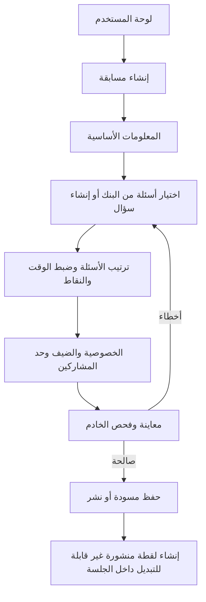
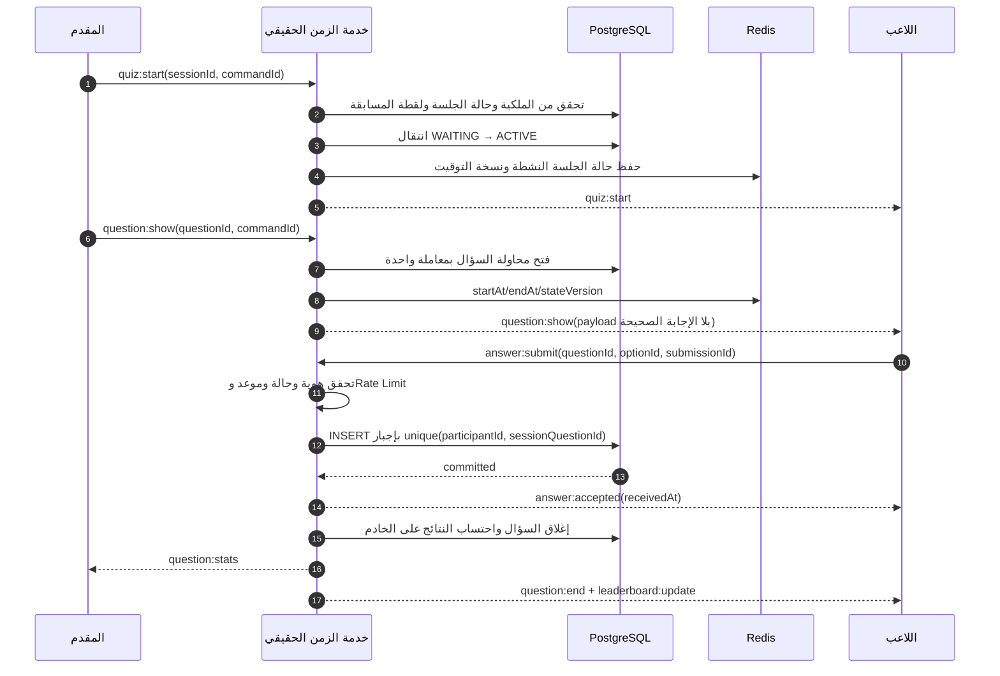
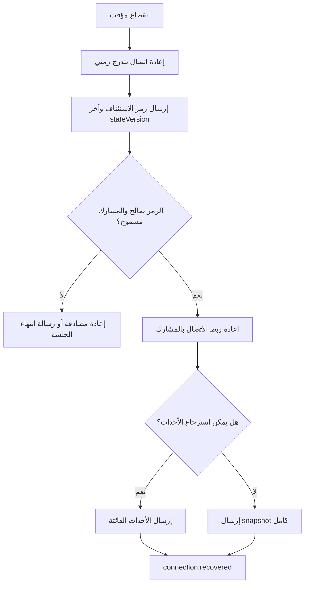

# تدفقات المستخدم — تحدّي

> تعتمد هذه الوثيقة على نطاق MVP في `product-requirements.md`.

الوثائق المرتبطة: `architecture.md` للبنية والعقود، و`permissions.md` للتفويض.

## 1. خريطة الرحلة

| المرحلة | اللاعب | مقدم المسابقة | النظام |
|---|---|---|---|
| الاكتشاف | يرى دعوة أو يدخل الرمز | ينشئ حسابًا | يعرض الصفحة العامة بأقل احتكاك |
| الإعداد | يختار اسمًا وصورة | يبني أسئلة وينشر المسابقة | يتحقق من الصلاحية والحدود |
| الانتظار | ينضم ويرى حالته | يراقب الحضور ويشارك الرمز | يثبت العضوية ويبث القائمة |
| اللعب | يستقبل ويجيب مرة | يدير السؤال والحالة | يضبط الوقت ويقبل الإجابة ويحسبها |
| النتيجة | يرى ترتيبه | يعرض الفائزين | يحفظ النتيجة والتقرير |
| العودة | يراجع السجل إن كان مسجلًا | ينسخ المسابقة | يوفر تاريخًا وتحليلات أساسية |

## 2. حالات الاستخدام الأساسية

### الزائر/الضيف

- الانضمام برمز غرفة واسم مستعار.
- معرفة سبب فشل الانضمام وطريقة التصحيح.
- الانتظار ثم اللعب وإعادة الاتصال ورؤية النتيجة.
- لا يملك سجلًا دائمًا خارج سياسة الاحتفاظ إلا بعد ترقية الحساب.

### اللاعب المسجل

- كل ما للضيف، إضافة إلى حفظ السجل والملف.
- مشاهدة النتائج السابقة والإحصاءات البسيطة.
- إنشاء مسابقات ضمن حد الخطة، فينتقل عمليًا إلى قدرات المقدم.

### مقدم المسابقة

- إدارة الأسئلة والمسودات والنشر.
- فتح جلسة وإدارة الانتظار ودورة الأسئلة.
- معالجة مشارك مزعج، إنهاء الجلسة، وقراءة التقرير.

### مدير النظام

- البحث والمراجعة والتعليق والإخفاء.
- مراجعة سجل التدقيق دون تعديل السجل نفسه.

## 3. تدفق التسجيل والدخول

1. يختار المستخدم البريد أو Google؛ دخول الجوال نقطة توسع لاحقة.
2. يتحقق الخادم من المدخل وRate Limit وحالة الحساب.
3. عند النجاح يصدر جلسة آمنة ويعيد الوجهة الأصلية.
4. عند حساب معلق لا يكشف النظام تفاصيل داخلية ويعرض قناة اعتراض.
5. كل عملية حساسة تعيد التحقق من الهوية والصلاحية، لا تعتمد على إخفاء الزر.

## 4. تدفق إنشاء مسابقة

### حالات الخطأ

- تجاوز حد الخطة: يمنع النشر مع توضيح الحد، ولا يفقد المسودة.
- سؤال ناقص أو بلا إجابة صحيحة: يحدد السؤال والخطأ.
- تعارض تعديل: يعرض نسخة أحدث وخيار إعادة التحميل؛ لا يكتب فوقها بصمت.
- حذف سؤال مستخدم: يؤرشف الأصل وتبقى اللقطة المنشورة.

## 5. تدفق الانضمام

1. يفتح اللاعب `/join/[code]` أو يكتب الرمز.
2. يتحقق الخادم من صيغة الرمز، وجود الجلسة، حالتها، السعة، والحظر.
3. يختار اللاعب اسمًا مستعارًا وصورة؛ تنظف المدخلات وتطبق سياسة الاسم.
4. ينشئ الخادم `Participant` ويصدر رمز استئناف مربوطًا بالجهاز/الجلسة ومدة قصيرة.
5. ينضم اتصال WebSocket بعد مصافحة موثقة، ثم يرسل الخادم لقطة الحالة.
6. تظهر غرفة الانتظار، ويُبث للمقدم حدث انضمام دون بيانات خاصة.

### تكرار الاسم

- الافتراضي: الاسم فريد داخل الجلسة بعد التطبيع Unicode وإزالة المسافات الطرفية ومقارنة غير حساسة للحالة.
- عند التعارض يقترح النظام أسماء بديلة ولا ينشئ مشاركًا ناقصًا.

### الدخول بعد البدء

- السياسة الافتراضية في MVP: يمنع لاعب جديد بعد البدء، ويسمح فقط بهوية استئناف معروفة.
- يمكن إضافة خيار «الانضمام المتأخر» لاحقًا، ويجب أن يحدد أثر الأسئلة الفائتة على الترتيب.

## 6. التدفق المرجعي للمسابقة المباشرة

### حالات دورة السؤال

`PENDING → OPEN → LOCKED → REVEALED → SCORED`

- لا يسمح بالرجوع إلى حالة سابقة.
- الانتقال يحتاج `commandId` ونسخة حالة متوقعة لمنع الأوامر المكررة.
- انتهاء الوقت مهمة خادمية؛ واجهة المؤقت عرض مشتق من `serverNow` و`endsAt`.

## 7. تدفق إرسال الإجابة

1. يعطل العميل الخيارات بعد الإرسال لتحسين التجربة، لكن هذا ليس حماية أمنية.
2. يرسل `submissionId` UUID، معرف السؤال، الخيار، ونسخة الحالة؛ لا يرسل نقاطًا أو زمنًا موثوقًا.
3. يسجل الخادم `receivedAt` فور الوصول ويتحقق من نافذة السؤال.
4. ينفذ إدخالًا ذريًا بقيد فريد.
5. عند إعادة الطلب بنفس `submissionId` يعاد الإقرار نفسه.
6. عند إجابة ثانية مختلفة يعاد `ANSWER_ALREADY_SUBMITTED`.
7. عند التأخر يعاد `QUESTION_CLOSED` مع حالة حديثة، دون احتساب.

## 8. تدفق إعادة الاتصال

قواعد مهمة:

- نجاح إعادة الاتصال لا يعتمد فقط على ميزة مكتبة النقل؛ المسار الدائم هو مزامنة Snapshot من حالة الخادم.
- لا تعاد إجابة مجهولة الحالة تلقائيًا إلا بنفس `submissionId`.
- إذا انتهى السؤال أثناء الانقطاع، يرى اللاعب النتيجة الحالية ولا يسمح له بالإجابة بأثر رجعي.

## 9. فقد اتصال المقدم

- تستمر ساعة السؤال الحالية على الخادم ولا تتوقف تلقائيًا.
- تظهر شاشة العرض حالة «إعادة اتصال المقدم» بعد الإغلاق إن لم يصل أمر متابعة.
- يستعيد المقدم الجلسة بنفس الحساب ورمز تحكم قصير العمر.
- لا يسمح بجهازين بإرسال أوامر متعارضة؛ Lease للمقدم الرئيسي في Redis مع نسخة قيادة.
- عند انتهاء الـLease يمكن للمقدم الموثق استعادته، ويسجل الانتقال في AuditLog.

## 10. الإيقاف والاستئناف والإنهاء

- الإيقاف مسموح بين الأسئلة في MVP. إيقاف سؤال مفتوح ميزة مؤجلة لتجنب غموض الوقت.
- إنهاء مبكر يحتاج تأكيدًا وسببًا؛ تحفظ النتائج المكتملة وتوسم الجلسة `CANCELLED` أو `FINISHED_EARLY`.
- عند السؤال الأخير ينفذ الخادم التسوية النهائية ثم يقفل النتائج قبل بث منصة الفائزين.

## 11. تدفق الإدارة والبلاغ

1. يصل بلاغ مرتبط بكيان ومبلغ ومجموعة أسباب محددة.
2. يراجعه مشرف مخول لا ينتمي إلى صاحب البلاغ عند تضارب المصالح.
3. يختار: لا إجراء، إخفاء مؤقت، إزالة، تعليق حساب، أو تصعيد.
4. كل إجراء يتطلب سببًا، ويسجل الفاعل والقيم السابقة واللاحقة.
5. لا يرى المبلغ بيانات المعالجة الداخلية؛ يتلقى حالة عامة فقط.

## 12. مصفوفة الحالات الحدية

| الحالة | سلوك النظام | رسالة المستخدم |
|---|---|---|
| رمز غير موجود | لا يكشف جلسات مشابهة | الرمز غير صحيح أو انتهت صلاحيته |
| غرفة ممتلئة | لا ينشئ Participant | اكتمل عدد المشاركين |
| الغرفة مغلقة | يسمح بالاستئناف فقط | بدأت المسابقة ولا تقبل لاعبين جددًا |
| اسم مكرر | يقترح بدائل | الاسم مستخدم في هذه الغرفة |
| إجابة مكررة | يعيد الإقرار السابق أو يرفض الثانية | تم تسجيل إجابتك بالفعل |
| انتهاء الوقت أثناء النقل | يعتمد `receivedAt` الخادم | انتهى وقت السؤال |
| توقف Redis | يوقف فتح أسئلة جديدة أو يعمل بعقدة واحدة حسب Runbook | تعذر المتابعة مؤقتًا |
| توقف قاعدة البيانات | لا يقر إجابة غير محفوظة | نحاول إعادة الاتصال؛ لم تُسجل الإجابة بعد |
| إعادة تشغيل الخادم | يعيد بناء Snapshot من PostgreSQL/سجل الحالة | تمت استعادة الجلسة |
| لاعب محظور | يقطع الاتصال ويرفض المصافحة | أُوقفت مشاركتك |
| ملف غير صالح | يعزل الملف ولا ينشره | نوع الملف أو حجمه غير مسموح |

## 13. حالات الواجهة المشتركة

كل شاشة بيانات تنفذ حالات: تحميل، فارغة، نجاح، خطأ قابل للمحاولة، خطأ صلاحية، اتصال غير مستقر، وعدم اتصال. لا تعرض الواجهة مؤشرات نجاح متفائلة لعمليات حاسمة مثل قبول الإجابة أو نشر المسابقة قبل إقرار الخادم.
